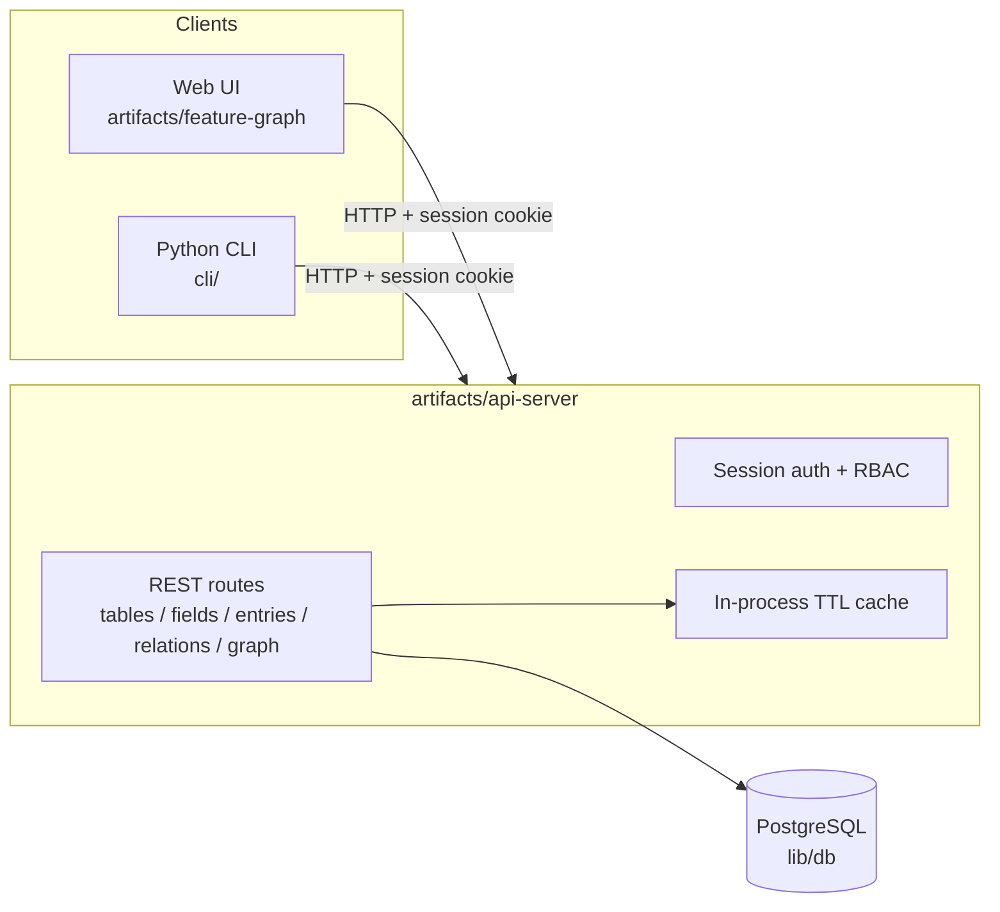
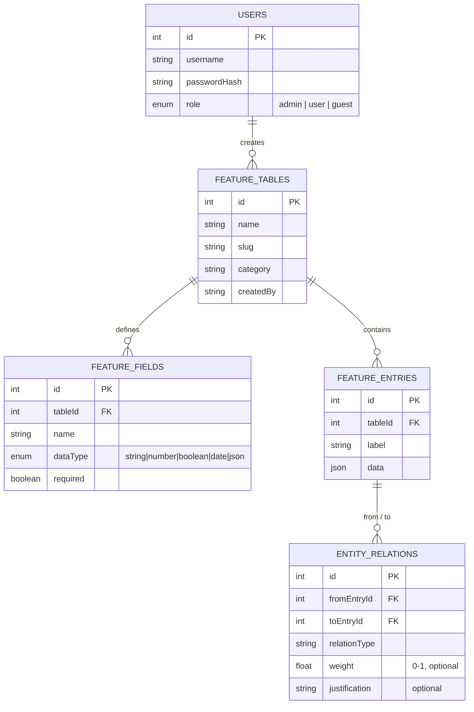
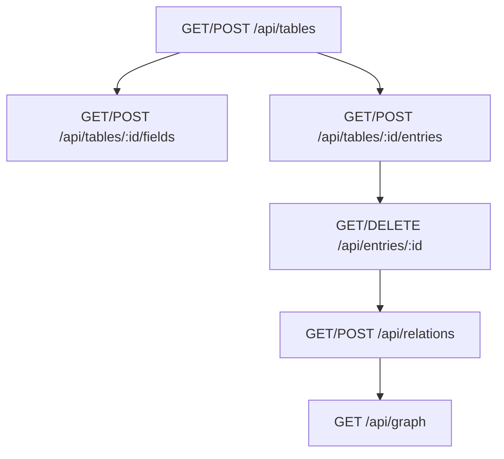

# Feature Graph

A knowledge-graph platform for feature engineering: define typed data
tables, populate them with entries, connect entries with weighted/justified
relations, and explore the resulting graph — from a web UI, a CLI, or the
HTTP API directly. Ships with an NBA player-props dataset as a worked
example of a feature-engineering domain.

## What's built

| Piece | Where | Status |
|---|---|---|
| HTTP API (auth, tables, fields, entries, relations, graph query) | `artifacts/api-server` | Built & running |
| Web UI (graph explorer, table/field/entry management, auth) | `artifacts/feature-graph` | Built & running |
| Postgres schema (Drizzle ORM) | `lib/db` | Built & pushed |
| Session-based auth with roles (admin/user/guest) | `artifacts/api-server/src/middlewares/auth.ts` | Built |
| Python CLI | `cli/` | Built |
| Seed data (NBA player props example) | `artifacts/api-server/src/scripts/seed.ts` | Built |
| Docker / Kubernetes / GitHub Actions | `deploy/` | **Reference only** — see below |

## Architecture



## Data model



`FEATURE_FIELDS` describes the schema; `FEATURE_ENTRIES.data` is a JSON blob
validated against that schema at the UI/CLI layer (not enforced at the DB
layer, so the model stays generic across arbitrary feature-engineering
domains, not just sports betting).

## API



Full request/response shapes live in `lib/api-spec/openapi.yaml`; the web UI
and the generated TanStack Query hooks (`lib/api-client-react`) are both
generated from it via Orval, so the contract, the frontend hooks, and the
Zod validators are always in sync. The CLI talks to the same REST endpoints
directly over HTTP.

## Auth model

Custom-built, session-cookie based (no third-party auth provider):

- **First registered user becomes `admin`** automatically; everyone after
  gets `user`.
- **`guest`** is implicit for unauthenticated requests — never persisted as
  a user row. Guests get read-only access; `user` and `admin` can create and
  delete data.
- Sessions are stored in Postgres via `connect-pg-simple` and signed with
  `SESSION_SECRET`.

## Running it

This project runs on Replit; the three workflows (`API Server`, `web`,
`Component Preview Server`) start automatically. To use the CLI or re-seed
data manually:

```bash
# Seed example data (idempotent — safe to re-run)
pnpm --filter @workspace/api-server run seed

# CLI (run from the repo root; talks to the API server on localhost:8080)
uv run cli/main.py --help
uv run cli/main.py auth login --username demo --password demo12345
uv run cli/main.py graph --as-tree
```

The seed script creates a `demo` / `demo12345` admin account if no users
exist yet.

## Deployment

Publish through Replit's own deployment system (see the `deployment` skill /
the Publish button) — that's the supported path for this project. The
`deploy/` folder (Docker, Kubernetes, GitHub Actions) is **reference-only**
documentation for running this codebase on non-Replit infrastructure; it is
not wired into this Repl and is not exercised by anything here. See
`deploy/README.md`.

## Roadmap / explicitly deferred

Scoped out of this build; documented here so the gap is explicit rather than
silent:

- **Web scraping / NLP pipelines** for auto-populating feature tables from
  external text sources.
- **Multi-LLM orchestration** (e.g. routing feature-generation prompts
  across multiple model providers).
- **Neo4j-backed graph storage** — the API and CLI are deliberately
  designed so the `/graph` endpoint could be re-pointed at a real graph
  database later; today it's computed from the relational schema in
  Postgres.
- **Redis-backed caching** — the API uses a simple in-process TTL cache
  today (`artifacts/api-server/src/lib/cache.ts`); fine for a single
  instance, not for multi-instance deployments.
- **vis.js / three.js graph rendering** — the web UI renders the graph with
  `react-force-graph-2d`; a 3D or vis.js-based renderer is a possible future
  swap, not built here.
- **Dedicated testing microservice** (POM/BDD/data-driven test suite as a
  separate service) — out of scope for this build; verification here was
  manual/scripted smoke testing (curl + seed script) rather than an
  automated test suite.
- **Live Docker/Kubernetes/CI execution** — the manifests in `deploy/` are
  reference documentation only, not run as part of this Repl.
- **Quantum computation** — not applicable to this domain; not built.

## Where things live

- `artifacts/api-server` — Express API (routes, auth, caching, seed script).
- `artifacts/feature-graph` — React + Vite web UI.
- `artifacts/mockup-sandbox` — canvas/design preview sandbox (not part of the
  shipped product).
- `lib/db` — Drizzle schema, migrations.
- `lib/api-spec` — OpenAPI source of truth.
- `lib/api-client-react` — generated TanStack Query hooks.
- `cli/` — Python CLI client.
- `deploy/` — reference-only Docker/K8s/GitHub Actions docs.
