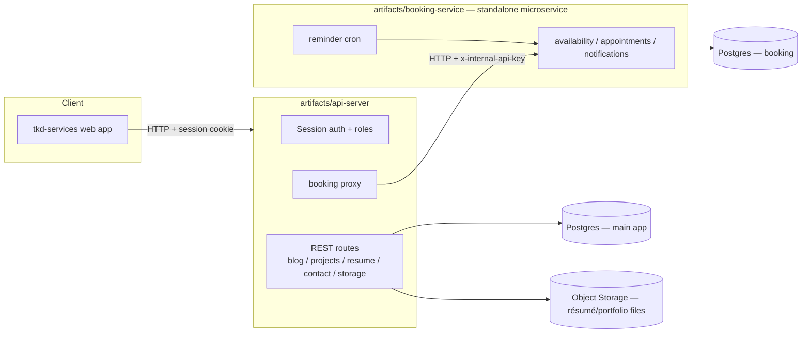

# TKD Services

A personal portfolio / independent-consulting website with a résumé
manager, a project portfolio, a blog, a contact form, and call-booking —
plus a small internal dev tooling suite (test status dashboard, feature
graph explorer, mockup sandbox) used while building the product, not part
of what a visitor sees.

## What's built

| Piece | Where | Notes |
|---|---|---|
| Public site (hero, about, portfolio, blog, contact) | `artifacts/tkd-services` | React + Vite frontend |
| Résumé manager (upload, version, publish) | `artifacts/tkd-services` (admin UI) + `artifacts/api-server/src/routes/resume.ts` | Uploads go through Object Storage |
| Portfolio projects (CRUD) | `artifacts/api-server/src/routes/projects.ts` | |
| Blog (CRUD) | `artifacts/api-server/src/routes/blog.ts` | |
| Contact form | `artifacts/api-server/src/routes/contact.ts` | |
| Auth (sessions, roles) | `artifacts/api-server/src/routes/auth.ts` | First registered user becomes admin |
| Call booking | `artifacts/booking-service` (proxied by `artifacts/api-server/src/routes/booking.ts`) | Standalone microservice, own DB, own repo |
| Object storage (résumé PDFs, images) | `artifacts/api-server/src/lib/objectStorage.ts` | Replit-managed GCS bucket |
| Test status dashboard (internal) | `artifacts/status-dashboard` | Not part of the public site |
| Feature/graph explorer (internal) | `artifacts/feature-graph` | Not part of the public site |
| Design/mockup sandbox (internal) | `artifacts/mockup-sandbox` | Not part of the public site |
| Docker / Kubernetes / GitHub Actions | `deploy/`, root `docker-compose.yml`, `.github/workflows/` | Reference tooling for running this off Replit — see below |

## Architecture



The booking microservice is intentionally decoupled: it has its own
Postgres schema, its own Dockerfile, and its own repository
(https://github.com/itkdaniel/tkd-booking-service) so it can be dropped
into a different project unchanged. The main app never talks to the
booking database directly — only over HTTP through `BOOKING_SERVICE_URL`,
authenticated with a shared `BOOKING_SERVICE_API_KEY`.

## Repositories

This project is published across multiple GitHub repositories:

| Repo | Contents |
|---|---|
| [`itkdaniel/tkd-services-platform`](https://github.com/itkdaniel/tkd-services-platform) | This monorepo — main app (frontend + API server), a copy of the booking service, deploy tooling, CI/CD, docs |
| [`itkdaniel/tkd-booking-service`](https://github.com/itkdaniel/tkd-booking-service) | Standalone booking microservice, published separately so it can be reused in other projects without the rest of this repo |

The copy of `artifacts/booking-service` in this monorepo is the source of
truth for the platform; changes to it are also pushed to the standalone
repo (see "Cutting a release" below).

## Prerequisites

- Node.js 24, [pnpm](https://pnpm.io/) 10 (via `corepack enable`)
- PostgreSQL 16 (two logical databases — one for the main app, one for
  booking; see below)
- Python 3.11 + [uv](https://docs.astral.sh/uv/) — only needed if you use
  the `scripts/` tooling in this repo
- Docker + Docker Compose — only needed for the self-hosted path

## Environment variables / secrets

Set these as Replit Secrets when running on Replit, or in a `.env` file /
your process manager when self-hosting. See `.env.example` at the repo root
and `artifacts/booking-service/.env.example` for the full annotated list.

| Variable | Used by | Purpose |
|---|---|---|
| `DATABASE_URL` | api-server | Main app Postgres connection |
| `SESSION_SECRET` | api-server | Signs session cookies |
| `PORT` | every service | Port each service binds to (Replit sets this automatically) |
| `BASE_PATH` | tkd-services | Base path the frontend is served under (`/` when self-hosted) |
| `BOOKING_SERVICE_URL` | api-server | Where to reach the booking microservice |
| `BOOKING_SERVICE_API_KEY` | api-server, booking-service | Shared secret for service-to-service calls (`x-internal-api-key`) |
| `BOOKING_DATABASE_URL` | booking-service | Booking microservice's own Postgres connection |
| `ADMIN_NOTIFICATION_EMAIL` / `ADMIN_NOTIFICATION_LABEL` | booking-service | Who gets booking notifications |
| `EMAIL_PROVIDER` (`gmail` or `smtp`) + `SMTP_*` / `EMAIL_FROM` | booking-service | Outbound email for booking confirmations/reminders |
| `PUBLIC_OBJECT_SEARCH_PATHS`, `PRIVATE_OBJECT_DIR`, `DEFAULT_OBJECT_STORAGE_BUCKET_ID` | api-server | Object Storage bucket for résumé PDFs and portfolio images |

Never commit real values for any of these — `.env.example` files document
names only.

## Running it on Replit

The `Booking Service` workflow starts automatically. Start the other pieces
from the shell or their own workflow buttons:

```bash
pnpm --filter @workspace/api-server run dev       # main app backend, port 8080
pnpm --filter @workspace/tkd-services run dev      # main app frontend
pnpm --filter @workspace/status-dashboard run dev  # internal test dashboard
pnpm --filter @workspace/feature-graph run dev     # internal feature/graph explorer
pnpm run typecheck                                 # typecheck everything
pnpm run build                                     # typecheck + build everything
```

Publish through Replit's own deployment system (the Publish button / the
`deployment` skill) — that's the supported path for running this in
production. Object storage, secrets, and the booking service workflow are
already wired up for that path.

## Running via Docker Compose (self-hosted)

The root [`docker-compose.yml`](./docker-compose.yml) is **reference
tooling for running this project outside Replit** — it is not executed
inside this dev environment, since Replit doesn't run Docker natively here.
On any machine with Docker installed:

```bash
cp .env.example .env.docker   # fill in real secrets (see table above)
docker compose --env-file .env.docker up --build
```

This starts two Postgres instances (main app + booking), the API server
(`:8080`), the built frontend (`:5000`), and the booking microservice
(`:8000`). See `deploy/README.md` for what each file under `deploy/` does
and the Kubernetes manifests if you're running a cluster instead.

**Known gap:** résumé/portfolio file uploads use Replit's built-in Object
Storage sidecar for credentials. Outside Replit, you need to point
`artifacts/api-server/src/lib/objectStorage.ts` at a real Google Cloud
Storage bucket with your own service-account credentials (or swap in a
different storage backend) — the reference Compose config does not do this
for you.

## Testing

```bash
pnpm --filter @workspace/api-server run test:coverage
pnpm --filter @workspace/booking-service run test:coverage
```

Both run automatically on every push/PR via
[`.github/workflows/ci.yml`](./.github/workflows/ci.yml), alongside a
workspace-wide typecheck + build. Coverage reports are uploaded as CI
artifacts.

## Cutting a release

1. Make sure `main` is green in [Actions](https://github.com/itkdaniel/tkd-services-platform/actions).
2. Decide the next version (`vMAJOR.MINOR.PATCH`, e.g. `v1.0.0` → `v1.1.0`).
3. Tag and push:
   ```bash
   git tag v1.1.0
   git push origin v1.1.0
   ```
4. Pushing a `v*` tag triggers [`.github/workflows/release.yml`](./.github/workflows/release.yml),
   which reruns the full test suite, builds every service, packages the
   build output, and publishes a GitHub Release with those artifacts
   attached. You can also trigger it manually (without tagging) from the
   Actions tab for a dry run.
5. If `artifacts/booking-service` changed, mirror the change into the
   standalone [`tkd-booking-service`](https://github.com/itkdaniel/tkd-booking-service)
   repo (copy the directory contents and push) so the two stay in sync.

## Roadmap / explicitly deferred

- **Live Docker/Kubernetes execution** — the manifests under `deploy/` and
  the root `docker-compose.yml` are real, working reference configs, but
  they are not run as part of this Repl; verification here is via the CI
  workflow's typecheck/build/test steps, not a live container run.
- **Object storage outside Replit** — see the "Known gap" note above.
- **Redis-backed caching** — the API uses a simple in-process cache where
  needed today; fine for a single instance, not multi-instance deployments.

## Where things live

- `artifacts/tkd-services` — the public site (React + Vite): home, about,
  portfolio, blog, contact, résumé admin.
- `artifacts/api-server` — Express API: auth, blog, projects, résumé,
  contact, storage, booking proxy.
- `artifacts/booking-service` — standalone booking microservice (own
  Postgres schema, own Dockerfile, own repo).
- `artifacts/status-dashboard`, `artifacts/feature-graph`,
  `artifacts/mockup-sandbox` — internal dev tooling, not part of the public
  product.
- `lib/db` — Drizzle schema shared by the main app.
- `deploy/` — reference-only Docker/Kubernetes docs; `github-actions/ci.yml`
  is a static copy of the live workflow for forks.
- `.github/workflows/` — the CI (`ci.yml`) and release (`release.yml`)
  workflows that actually run on GitHub.
- `cli/`, `scripts/` — supporting tooling not part of the shipped product.
